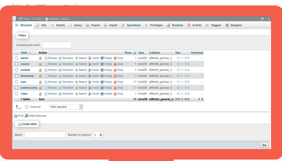
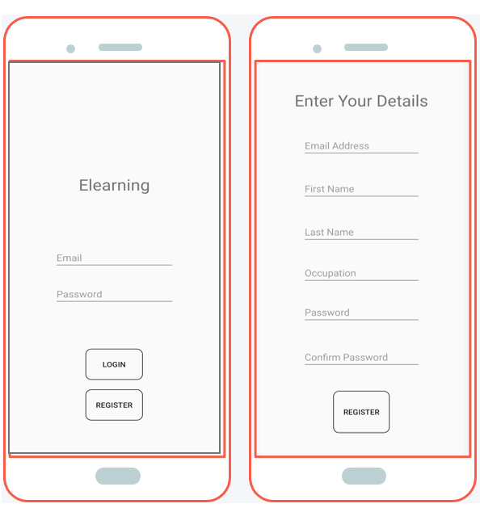
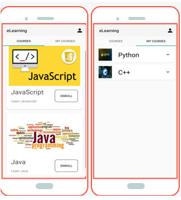
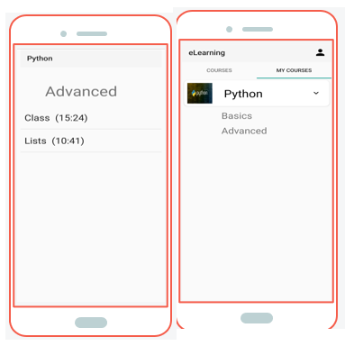

# eLearning-App
An eLearning Android app with backend in MySQL which allows user to enroll into courses and access available material for that topic. This a java based android app for demonstration of remote hosted e-Learning content streamer

# Backend
The backend is Database server hosted using xampp, and connection to it using jdbc:mysql in android. 
All the content(images and videos) is stored in server and streamed to android.
Content is displayed using different views and adapters in available in android.
The code is attached with this presentation.

# Functionalities:
 
 

 Fig: login
 
 

 Fig: Once logged in user has two tabs the COURSES which shows all the available courses in which user has not yet enrolle, As user enrols into new courses they would appear under MY COURSES tab
 
 

 Fig: Upon clicking the courses user can see its modules and click on any of the module he/she want to learn,Upon clicking the module user can see the available content on that module.
 
 

 Fig: User can watch the video of the topic. 

